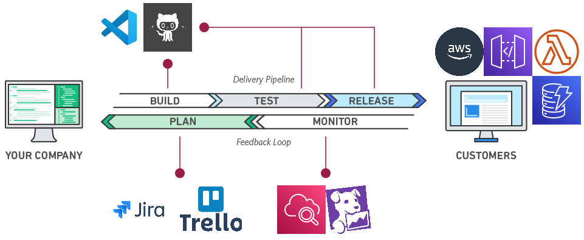
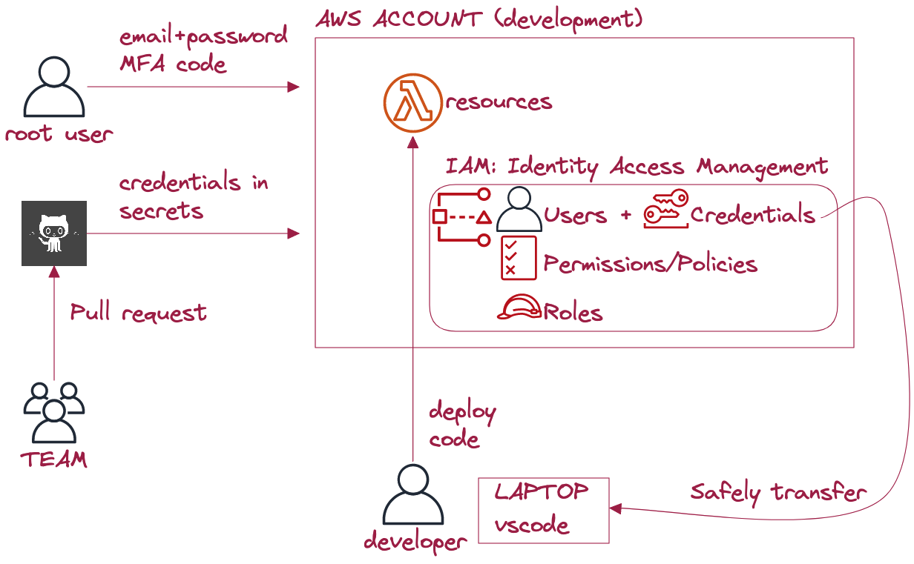
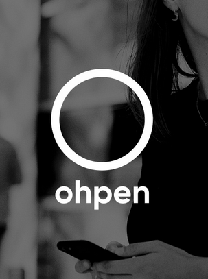
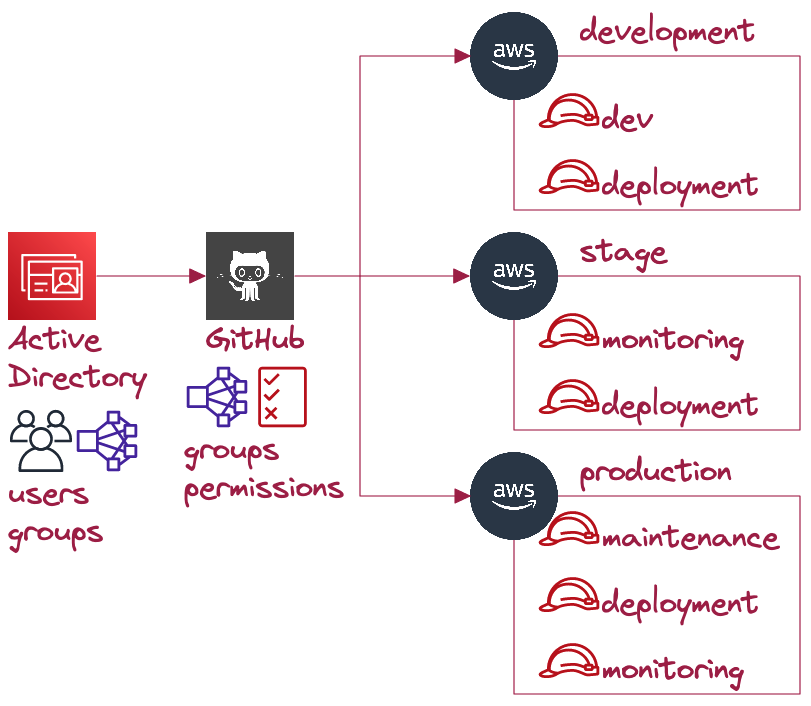

<!--
_class: invert
-->

# **Cloud and DevOps**

1. Hello Cloud
2. Software development
3. AWS & Serverless
4. Security in AWS
5. Advanced Security & CICD
6. Testing, Cost and Security at Ohpen
7. 🥳 **Final Recap + Guest speaker** 🥳

---

# **Today class ...**

- `09:00`-`11:00`: Recap

- `11:00`-`11:30`: Break + Conference setup

- `11:30`-`13:00`: Conference + Q&A

---

# **DEV**elopment & **OP**eration**S**

> Culture, practices, and tools that teams use to deliver services at high velocity.

[What is Devops?](https://aws.amazon.com/devops/what-is-devops/)

---

# DevOps **Culture**

> Break barries between siloed [teams](https://teamtopologies.com/):
> `Development`, `QA`, `Security`, and `Operations`

- Improve the productivity of developers and reliability of operations.
- Communicate frequently, increase efficiency, and improve quality.
- Full ownership with Customer-first mindset.

---

# DevOps **Practices**

- Frequent and small updates.
- Decoupled architectures: Micro-services, Event-driven
- **C**ontinuous **I**ntegration and **D**elivery
- Infrastructure automation: IaC such as Terraform
- Monitoring: execution and performance via Cloudwatch
- ...

---

# DevOps **Tools**

---

---

# **Security** recap

---

# Security **IAM roles**

> How do we translate user permissions into Services?

- Roles can be assumed if allowed.
- Roles don't have credentials but temporary keys.
- AWS services use IAM roles. [Let's see it](https://github.com/EduardBargues/bts_session5_13_06_2023).
- How are our lambdas allowed to access our Dynamodb?

---

# **Permissions at Ohpen**

- How users access AWS?
- How does Github deploy?
- How we ensure nobody can deploy from laptop?

---

[Active Directory](https://portal.azure.com/#view/Microsoft_AAD_IAM/ActiveDirectoryMenuBlade/~/Overview)
&
AWS SSO

